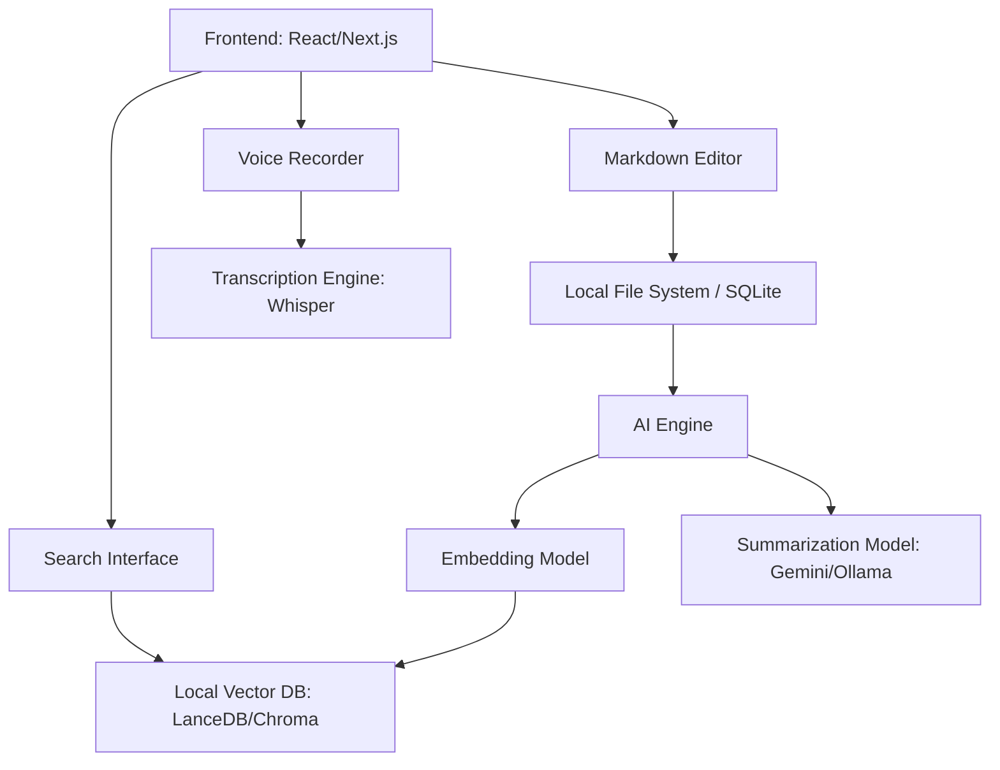

# Architecture Documentation: AI Notes App

## System Overview
The AI Notes App is a local-first web application designed for high performance and privacy. It utilizes a modular architecture to separate the UI, Storage, and AI Processing layers.

## Component Diagram

## Data Flow Diagram
### Note Creation & Indexing
1. User saves a Markdown note.
2. System writes note to local storage.
3. System triggers background task to generate embeddings for the new content.
4. Embeddings are stored in the Vector DB with a reference to the note ID.

### Semantic Search
1. User enters a natural language query.
2. System generates embedding for the query.
3. System performs similarity search in the Vector DB.
4. Results are ranked and displayed to the user.

## ADRs
- [ADR 001: Initial Tech Stack](adr/001-initial-tech-stack.md)
